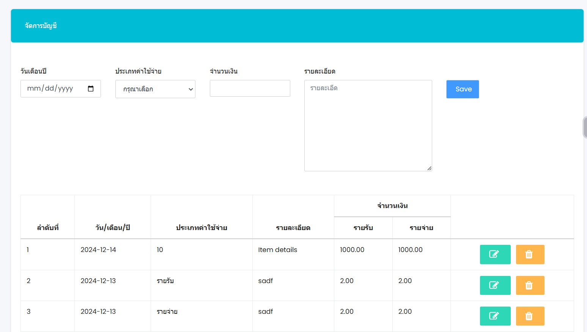
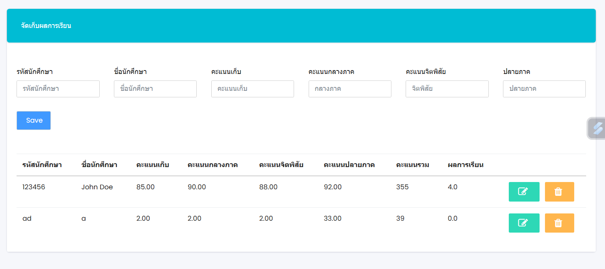
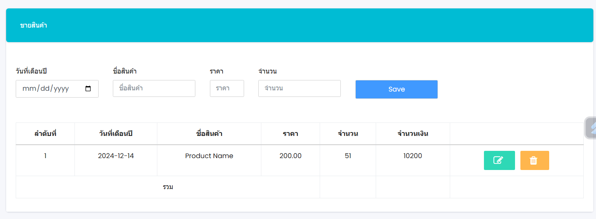
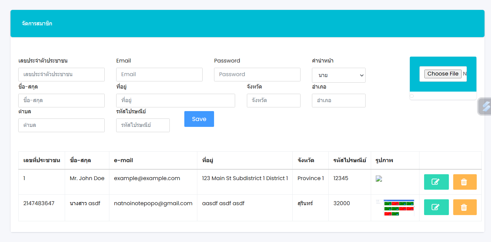

# LifeManage

# ระบบจัดการสมาชิกและข้อมูลต่าง ๆ  

## ฟีเจอร์หลัก  

1. **สมัครสมาชิก**  
   - สำหรับผู้ใช้งานที่ต้องการสร้างบัญชีใหม่  

2. **บัญชีครัวเรือน**  
   - จัดการบัญชีสำหรับครัวเรือน  

3. **จัดเก็บผลการเรียน**  
   - บันทึกและจัดการข้อมูลผลการเรียน  

4. **ขายสินค้า**  
   - ระบบสำหรับการขายสินค้า  

5 **จัดการสมาชิก**  
   - ผู้ดูแลระบบสามารถจัดการข้อมูลสมาชิกได้  
6 **ออกจากระบบ**  
   - ออกจากระบบการใช้งาน  

## รูปตัวอย่าง

